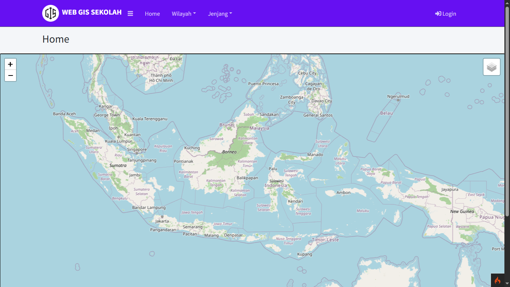
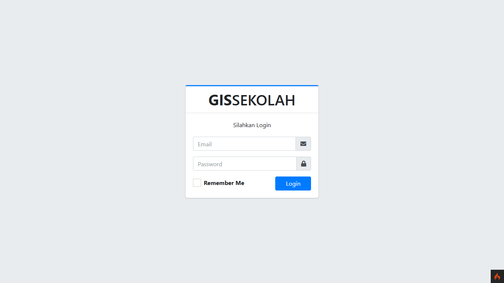
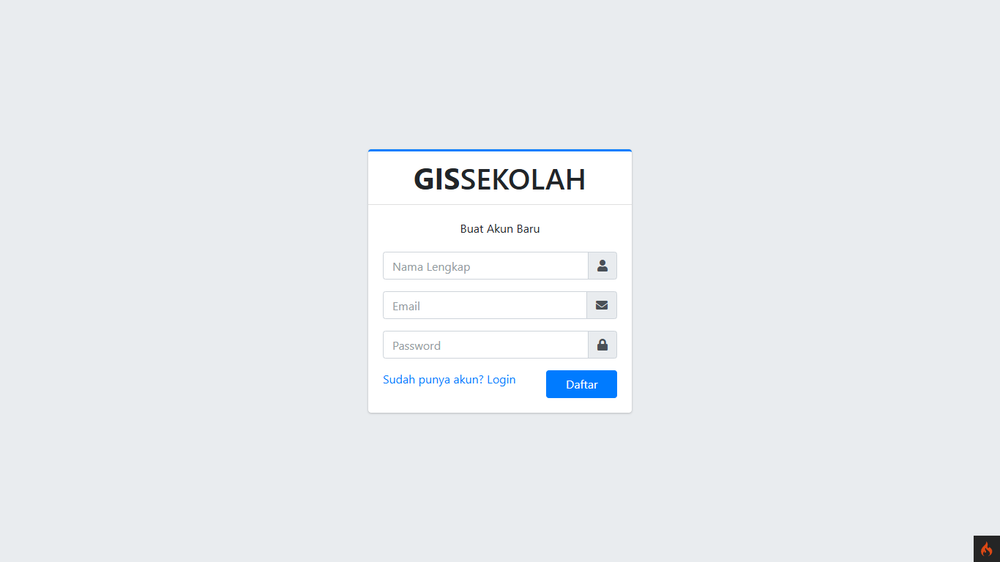
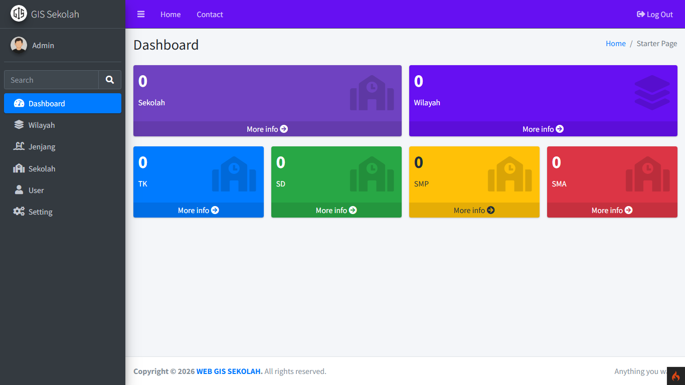

# 🗺️ School Web GIS - CodeIgniter 4

<p align="left">
  
  
  
  
  
  
</p>

A **Web-based Geographic Information System (Web GIS)** for managing and visualizing school locations, built with **CodeIgniter 4**, **Leaflet.js**, and **AdminLTE 3**.

This project allows administrators to manage school information and display school locations interactively on a digital map.

---

## ✨ Features

* 🔐 Admin Authentication (Login & Logout)
* 📍 Interactive school location mapping using Leaflet.js
* 🏫 School Management (Create, Read, Update, Delete)
* 📊 Responsive and modern Admin Dashboard
* 🧭 Interactive map for selecting school coordinates
* 📁 School image upload support
* 🌍 Regional-based school management
* 📌 Detailed school information page

---

## 🛠️ Built With

* CodeIgniter 4
* PHP 7.4+
* MySQL / MariaDB
* Leaflet.js
* AdminLTE 3
* Bootstrap
* jQuery
* Font Awesome

---

## 📚 Learning Reference

This project was developed by following and adapting concepts from the following tutorial series:

**YouTube Playlist**

> Building a School Web GIS using CodeIgniter 4 & Leaflet

https://youtube.com/playlist?list=PLYfaT5HP5yRrZa_MW_eQymabg4oKVq3D1&si=lx3skJM382Oww9II

Special thanks to the original content creator for providing valuable educational resources.

---

## 🚀 Installation

### 1. Clone the repository

```bash
git clone https://github.com/pangeran-droid/WebGIS-Sekolah-CI4.git
cd WebGIS-Sekolah-CI4
```

### 2. Install dependencies

```bash
composer install
```

### 3. Copy the environment file

```bash
cp env .env
```

or manually rename

```
env
```

to

```
.env
```

---

### 4. Configure your database

Edit the `.env` file:

```ini
database.default.hostname = localhost
database.default.database = your_database_name
database.default.username = root
database.default.password =
database.default.DBDriver = MySQLi
```

---

### 5. Import the database

Import the provided SQL file into your MySQL/MariaDB database.

---

### 6. Start the development server

```bash
php spark serve
```

---

### 7. Open your browser

```
http://localhost:8080
```

---

## 🔑 Default Admin Account

Use the following credentials to log in:

| Email                                     | Password |
| ----------------------------------------- | -------- |
| [admin@gmail.com](mailto:admin@gmail.com) | admin123 |

---

## 📁 Project Structure

```
app/
├── Config/
├── Controllers/
├── Models/
└── Views/

public/
└── AdminLTE/

writable/

.env
```

---

## 📌 Requirements

* PHP 7.4 or higher
* Composer
* MySQL or MariaDB
* Enable the following PHP extensions:

```
intl
curl
mbstring
openssl
mysqli
```

If you're using **Laragon** or **XAMPP**, place the project inside:

```
www/
```

or

```
htdocs/
```

---

## 👀 Preview

| Home | Login |
|---|---|
|  |  |

| Register | Dashboard |
|---|---|
|  |  |


---

## 🤝 Contributing

Contributions are welcome!

If you'd like to improve this project, feel free to:

* Fork this repository
* Create a new branch
* Commit your changes
* Submit a Pull Request

---

## 📄 License

This project is intended for educational purposes and academic learning.

You are free to use, modify, and distribute it in accordance with the project's license.
